# 🌿🦒🐊🍉 Mundo de Criaturas - Simulación de Ecosistema con POO

## 🤔 ¿COMO CLONAR EL REPOSITORIO?
En la terminal de git bash pon: git clone https://github.com/tuusuario/proyectopoo.git
- Luego: cd proyectopoo

# 🧐 MANUAL DE USUARIO:

## 🤓 FUNCIONALIDADES PRINCIPALES
- **Simulación por turnos**: Avanza el ecosistema paso a paso
- **Sistema de interacciones**:
  - Depredación (glorbos → jirafas)
  - Herbivoría (jirafas → plantas)
  - Efectos ambientales (agua mejora atributos)
- **Evolución dinámica**: Mutaciones que modifican habilidades

## DESCRIPCIÓN:
Simulación de un ecosistema virtual donde criaturas (animales y plantas) interactúan en un mapa bidimensional, implementando:
- Herencia multiple (`CriaturaBase → Animal → glorbo/jirafa`)
- Polimorfismo (métodos virtuales `actuar()`, `mostrar()`)
- Gestión de memoria con smart pointers (`shared_ptr`, `weak_ptr`)
- Relaciones de agregación/composición entre clases
  ### ¿QUÉ ENCONTRAMOS EN ESTE PROYECTO?
| Clase | Descripción |
|-------|-------------|
| `CriaturaBase` | Clase abstracta base con posición, vida y ataque |
| `Animal` | Clase intermedia con hambre, preferencias y personalidad |
| `Planta` | Vegetales con sistema de frutos |

### CRIATURAS:
| Clase | Características |
|-------|-----------------|
| `glorbo` | Depredador con escudo que ataca jirafas |
| `jirafa` | Herbívoro que esquiva y come plantas |

### MUNDO:
| Clase | Función |
|-------|---------|
| `Mapa` | Matriz de celdas para posicionamiento |
| `Celda` | Contiene criaturas y recursos (agua/comida) |
| `Ecosistema` | Controla la simulación y turnos |

## DIAGRAMA DE CLASES UML:

```mermaid
classDiagram
    direction TB

    class CriaturaBase {
        +string nombre
        +int vida
        +int ataque
        +int posx
        +int posy
        +void moverse(Mapa& mapa) 
        +void actuar(Mapa& mapa)* 
        +virtual void recibirAtaque(int daño) 
        +void mostrar()*
        +string getNombre() 
        +int getVida() 
    }
    
    class Animal {
        +string tipo
        +int niveldehambre
        +string preferencia
        +string personalidad
        +virtual void mutar() 
        +void regenerarvida(int cantidad) 
    }
    
    class Planta {
       +int frutos
        +int getFrutos() 
        +void recibirAtaque(int daño) 
        +void actuar(Mapa& mapa) 
    }
    
    class glorbo {
       +int escudo
        +override void recibirAtaque(int daño) 
        +override void actuar(Mapa& mapa)
        +int getescudo() 
    }
    
    class jirafa {
        +int salto
        +override void recibirAtaque(int daño) 
        +override void actuar(Mapa& mapa) 
        +int getsalto() 
        +override void mutar() 
    }
    
    class Celda {
       -bool tieneAgua
        -bool tieneComida
        -vector<shared_ptr<CriaturaBase>> criaturas
        +void setAgua(bool agua) 
        +void setComida(bool comida) 
        +bool hayAgua() 
        +bool hayComida() 
        +oid agregarCriatura(shared_ptr<CriaturaBase>) 
        +void eliminarCriatura(shared_ptr<CriaturaBase>) 
    }
    
    class Mapa {
       -int filas
        -int columnas
        -vector<vector<Celda>> celdas
        +obtenerCelda(int x, int y) Celda&
        +void mostrarMapa() 
        +int getFilas() 
        +int getColumnas() 
    }
    
    class Ecosistema {
        -shared_ptr<Mapa> mapa
        -vector<shared_ptr<CriaturaBase>> criaturas
        -int cicloActual
        +void agregarCriatura(shared_ptr<CriaturaBase>, int x, int y) 
        +void simularTurno() 
        +void mostrarMapa() 
        +void removerMuertas() 
        +void agregarAguaAleatoria(int cantidad) 
    }
    
    CriaturaBase <|-- Animal
    CriaturaBase <|-- Planta
    Animal <|-- glorbo
    Animal <|-- jirafa
    
    Ecosistema  o--  Mapa
    Mapa  o--  Celda
    Celda  o--  CriaturaBase
    
    glorbo --> jirafa : ataca
    jirafa --> Planta : consume
```

---

## 🔎 ARCHIVO HTML CREADO POR DOXYGEN:
file:///C:/Users/juanf/OneDrive/Desktop/Javeriana/2do_semestre/Programaci%C3%B3n%20orientada%20a%20objetos/html/index.html

## CRÉDITOS Y ROLES DEL EQUIPO:

**Integrantes del proyecto y sus contribuciones principales:**

| Nombre del Integrante | Rol Principal | Responsabilidades Clave |
|-----------------------|--------------|-------------------------|
| Samuel Cuervo | Desarrollador Backend | Lógica de comportamiento de criaturas, lógica para ensamblar criaturas con el ecosistema, casillas y mapa |
| Juan Felipe Sanchez | Desarrollador Backend - Desarrollador Doxygen file | Implementación de atributos unicos de las clases hijas como clases del entorno |
| Juan Camilo Espinosa |  Líder de Proyecto - Desarrollador README | Arquitectura del sistema, coordinación del equipo, administrador del repositorio |

**Contribuciones destacadas:**
- **Samuel Cuervo**:Implementó el sistema de gestión de memoria con smart pointers
- **Juan Felipe Sanchez**: Diseño el mapa del juego teniendo en cuenta los ciclos e interacciones de criaturas, casillas, ecosistema
- **Juan Camilo Espinosa**: Diseñó la jerarquía de clases base y el sistema de turnos
---

### AGRADECIMIENTOS ESPECIALES 🤍:
- **Profesorcito**: Profesorcito estamos infinitamente agradecidos por su enseñanza en este semestre, queremos dejarle saber que disfrutamos el curso aunque habian momentos de estres pero se logró llevar a cabo todo gracias a usted profesorcio, lo queremos mucho.
- **IA**: Por ser generadora de ideas y cambios tanto en el codigo como en el repositorio.

*Todos los miembros participaron activamente en reuniones semanales y revisiones de código.*

